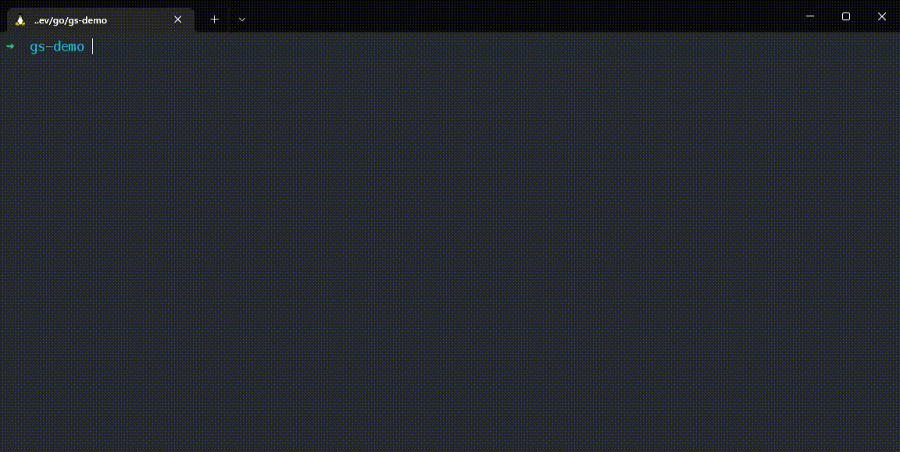

# Git-Secrets

````text
  ________.__  __      _________                            __
 /  _____/|__|/  |_   /   _____/ ____   ___________   _____/  |_  ______
/   \  ___|  \   __\  \_____  \_/ __ \_/ ___\_  __ \_/ __ \   __\/  ___/
\    \_\  \  ||  |    /        \  ___/\  \___|  | \/\  ___/|  |  \___ \
 \______  /__||__|   /_______  /\___  >\___  >__|    \___  >__| /____  >
        \/                   \/     \/     \/            \/          \/
````

## encryption and rendering engine for git repositories


Git Secrets encrypts your passwords and configurations for multiple environments and allows you to check them into a git repository. Using the GoLang templating engine, you can then decrypt them and write them to env files or Kubernetes deployment files.

### How does it work

- For each Project / Context you can use a **Encoder Secret** which is stored at `~/.git-secrets.yaml`
- The **Encoder Secret** is used to encode your passwords which are then stored inside your git repositories `.git-secrets.json`
- The encrypted secrets are then decoded and rendered using Go Web Templates like Helm for example. (https://gowebexamples.com/templates/)
- Each project can have multiple contexts for example `default` and `prod`
- Every custom context inherits from the `default` context, so you don't have to define values twice
- You can use a different **Encoder Secret** in each context so the engineer can only access the secrets he should need

### Demo



### Examples

- Encoding / Decoding: [with-binary-example](examples/with-binary-example)
- Kubernetes Secrets: [render-kubernetes-secret](examples/render-kubernetes-secret)
- Github Actions [.github/workflows/docker-release.yml](.github/workflows/docker-release.yml)

### Installation

via Homebrew / Linuxbrew
```
brew install benammann/tap/git-secrets 
```

via Docker

````bash
docker run benammann/git-secrets info
````

or just head over to the [Releases](https://github.com/benammann/git-secrets/releases) page and download the prebuilt binary manually

## Getting started

### Initialize the project
The configuration is made in a json file called `.git-secrets.json` you can also specify a custom path using `-f <path-to-custom-file>`

```bash
# Create a new global encoder secret (which you can later share with your team)
git secrets set global-secret mySecret --value $(pwgen -c 32 -n -s -y)

# Create a new .git-secrets.json
git secrets init

# Get the initial information of the config file
git secrets info

# Get the CLI's current version
git secrets version
```

### Encode a secret and add a config entry

Git-Secrets allows you to store encrypted `Secrets` and plain `Configs` both are stored in `.git-secrets.json`

```bash
# Encode a value (uses interactive input)
git secrets set secret databasePassword

# Write the value to a custom context
# Add Context: git secrets add context dev
git secrets set secret databasePassword -c dev

# Add a new config value
git secrets set config databaseHost db-host.svc.local

# Write the config value to a custom context
# Add Context: git secrets add context dev
git secrets set config databaseHost db-host.my-dev-db.svc -c dev
```

### Decode the secrets and get the config entry

```bash
# Get the decoded value
git secrets get secret databasePassword

# Get the value stored in databaseHost
git secrets get config databaseHost
```

### Create a `.env.dist` file

Git-Secrets allows you to render files using the `Secret` and `Config` values on the fly using gotemplates, just like Helm. For a syntax reference head over to https://gowebexamples.com/templates/

````text
DATABASE_HOST={{.Configs.databaseHost}}
DATABASE_PASSWORD={{.Secrets.databasePassword}}
````

You can have custom renderTargets to render files. For example `env` or `k8s`. You can than add multiple files to a renderTargets.

````bash
# always render .env.dist to .env
# uses the targetName: env
git secrets add file .env.dist .env -t env

# now execute the rendering process
# this renders the .env.dist file to .env and fills out all variables using the default context
# targetName: env
git secrets render env

# prints all available variables
git secrets render env --debug

# prints the rendered files to the console without actually writing the file
git secrets render env --dry-run

# renders the files using the prod context
git secrets render env -c prod
````


### Custom Template Functions

Git Secrets extends the GoLang Templating engine by some useful functions

#### Base64Encode

The Base64Encode function takes the first argument and encodes it as Base64. This allows you to render Kubernetes Secrets

````yaml
# Created by git-secrets
apiVersion: v1
data:
  apiPassword: "{{ Base64Encode .Secrets.applicationAPassword }}"
kind: Secret
metadata:
  name: api-application-a
  namespace: {{.Configs.namespace}}
type: Opaque
````

#### GitConfig

GitConfig allows you to resolve git config values. For example if you want to render files individually to the developer

````text
GIT_NAME={{GitConfig "user.name"}}
GIT_EMAIL={{GitConfig "user.email"}}
````


### Using Docker

There is also a Docker Image available: `benammann/git-secrets`.

Since git-secrets normally depends on a global `.git-secrets.yaml` you need to use the `--secret` parameter to pass the encryption secret using cli.
You also need to mount the project's `.git-secrets.json` file using docker volume mounts.

````bash
# just execute the help command
docker run benamnann/git-secrets help

# get all the information about the .git-secrets.json file
docker run \
  # mount .git-secrets.json to /git-secrets/.git-secrets.json
  -v $PWD/.git-secrets.json:/git-secrets/.git-secrets.json \
  # use the official docker image
  benammann/git-secrets \
  # execute the info command
  info
  
docker run \
  # mount .git-secrets.json to /git-secrets/.git-secrets.json
  -v $PWD/.git-secrets.json:/git-secrets/.git-secrets.json \
  # use the official docker image
  benammann/git-secrets \
  # pass the encryption secret 'gitsecretspublic' including it's value from an local Environment variable to docker
  --secret gitsecretspublic=${SECRET_VALUE} \
  # decrypt the secret crToken
  get secret crToken 
````

## Documentation

### How the encryption is done

Git-Secrets uses AES-256 to encrypt / decrypt the secrets. Read more about it here [Advanced Encryption Standard](https://de.wikipedia.org/wiki/Advanced_Encryption_Standard).

The encryption key is stored outside your git repository and can be referenced using multiple methods

The implementation can be found here [engine_aes.go](pkg/encryption/engine_aes.go).

#### Named Secrets
Named secrets are stored in `~/.git-secrets.yaml` and have a name. You can than reference it using the `context.decryptSecret.fromName` key.

````
"decryptSecret": {
    "fromName": "withbinaryexample"
},
````

You can define a `decryptSecret` in each context to for example encrypt the production secrets using a different encryption key. This can be useful to not let your developers know the CI/CD Secrets.

The CLI provides multiple ways how to configure and manage your global secrets.
```bash
# Generate via pwgen and read from stdin
git secrets set global-secret mySecret --value $(pwgen -c 32 -n -s -y)

# Set manually using interactive input
git secrets set global-secret mySecret

# Get the written secret
git secrets get global-secret mySecret

# Get all global secret names
git secrets get global-secrets
```

#### Overwrite using CLI Args

In case you don't want to store the secrets globally and on the disk you can also use the following cli args to inject the secrets at runtime

```bash
# Uses the secret passed via --secret (insecure)
git secrets get secret mySecret --secret secretName=$(SECRET_VALUE) --secret secretName1=$(SECRET_VALUE_1)
```