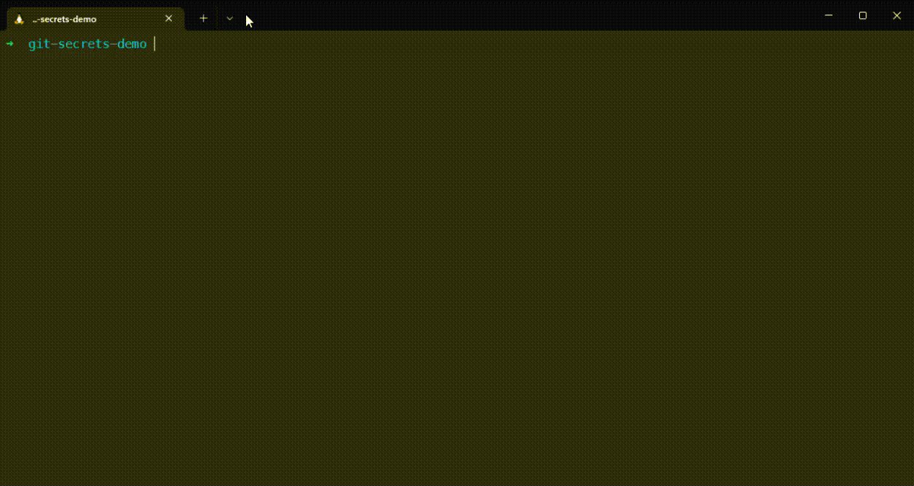
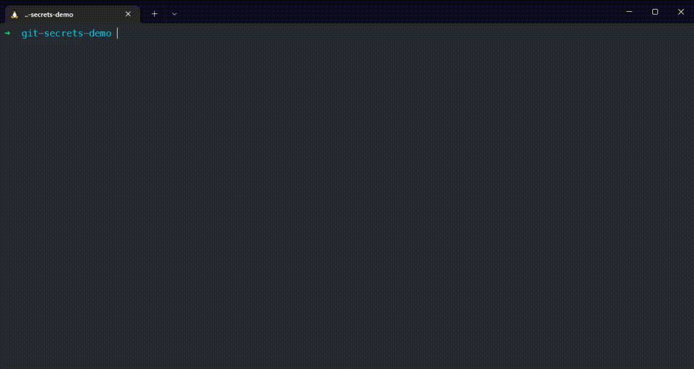

## encryption and rendering engine for git repositories


Git-Secrets allows you to add encrypted values to your git repository and decode them locally. The encrypted version is left in the upstream, the decoded version kept locally.

The main benefit is that you can render templates using the decoded values like `.env` file or event kubernetes deployment files. More details: https://github.com/benammann/git-secrets/tree/dev-beta/examples

Be aware that this project is still under development and the api may change.

### How does it work

- For each Project / Context you can use a **Encoder Secret** which is stored at `~/.git-secrets.yaml`
- The **Encoder Secret** is used to encode your passwords which are then stored inside your git repositories `.git-secrets.json`
- The encrypted secrets are then decoded and rendered using Go Web Templates like Helm for example. (https://gowebexamples.com/templates/)
- Each project can have multiple contexts for example `default` and `prod`
- Every custom context inherits from the `default` context, so you don't have to define values twice
- You can use a different **Encoder Secret** in each context so the engineer can only access the secrets he should need

### Demo

#### Initialize a new project


#### Add a new context and secret


### Examples

- Encoding / Decoding: [with-binary-example](examples/with-binary-example)
- Kubernetes Secrets: [render-kubernetes-secret](examples/render-kubernetes-secret)

### Installation

via Homebrew / Linuxbrew
```
brew install benammann/tap/git-secrets 
```

or just head over to the [Releases](https://github.com/benammann/git-secrets/releases) page and download the prebuilt binary manually

### Using Docker

There is also a Docker Image available: `benammann/git-secrets`.

Since git-secrets normally depends on a global `.git-secrets.yaml` you need to use the `--secret` parameter to pass the encryption secret using cli.
You also need to mount the project's `.git-secrets.json` file using docker volume mounts.

````bash
# just execute the help command
docker run benamnann/git-secrets help

# get all the information about the .git-secrets.json file
docker run \
  # mount .git-secrets.json to /git-secrets/.git-secrets.json
  -v $PWD/.git-secrets.json:/git-secrets/.git-secrets.json \
  # use the official docker image
  benammann/git-secrets \
  # execute the info command
  info
  
docker run \
  # mount .git-secrets.json to /git-secrets/.git-secrets.json
  -v $PWD/.git-secrets.json:/git-secrets/.git-secrets.json \
  # use the official docker image
  benammann/git-secrets \
  # pass the encryption secret 'gitsecretspublic' including it's value from an local Environment variable to docker
  --secret gitsecretspublic=${SECRET_VALUE} \
  # decrypt the secret crToken
  get secret crToken 
````

## Getting started

### Initialize the project
The configuration is made in a json file called `.git-secrets.json` you can also specify a custom path using `-f <path-to-custom-file>`

```bash
# Create a new global encoder secret (which you can later share with your team)
git-secrets global-secret mySecret $(pwgen -c 32 -n -s -y)

# Create a new .git-secrets.json
git-secrets init

# Get the initial information of the config file
git-secrets info
```

### Encode a secret and add a config entry

Git-Secrets allows you to store encrypted `Secrets` and plain `Configs` both are stored in `.git-secrets.json`

```bash
# Encode a value (uses interactive input)
git-secrets set secret databasePassword

# Add a new config value
git-secrets set config databaseHost db-host.svc.local
```

### Decode the secrets and get the config entry

```bash
# Get the decoded value
git-secrets get secret databasePassword

# Get the value stored in databaseHost
git-secrets get config databaseHost
```

### Create a `.env.dist` file

Git-Secrets allows you to render files using the `Secret` and `Config` values on the fly using gotemplates, just like Helm. For a syntax reference head over to https://gowebexamples.com/templates/

````text
DATABASE_HOST={{.Configs.databaseHost}}
DATABASE_PASSWORD={{.Secrets.databasePassword}}
````

Then add it to the local config file. You can specify multiple files to render for each context.

````bash
# always render .env.dist to .env
git-secrets add file .env.dist .env

# now execute the rendering process
# this renders the .env.dist file to .env and fills out all variables
git-secrets render
````

In case you want your files automatically to render in case of a file change in `.git-secrets.json` which may be triggered by a branch change for example you can use the daemon feature.

````bash
# add the file to the file watches and render its files using the default context
git-secrets daemon .git-secrets.json default

# then start the daemon
git-secrets daemon

# or start it as a background process
git-secrets daemon &
````

## Documentation

### How the encryption is done

Git-Secrets uses AES-256 to encrypt / decrypt the secrets. Read more about it here [Advanced Encryption Standard](https://de.wikipedia.org/wiki/Advanced_Encryption_Standard).

The encryption key is stored outside your git repository and can be referenced using multiple methods

The implementation can be found here [engine_aes.go](pkg/encryption/engine_aes.go).

#### Named Secrets
Named secrets are stored in `~/.git-secrets.yaml` and have a name. You can than reference it using the `context.decryptSecret.fromName` key.

````
"decryptSecret": {
    "fromName": "withbinaryexample"
},
````

You can define a `decryptSecret` in each context to for example encrypt the production secrets using a different encryption key. This can be useful to not let your developers know the CI/CD Secrets.

The CLI provides multiple ways how to configure and manage your global secrets.
```bash
# Generate via pwgen 
git-secrets global-secret mySecret $(pwgen -c 32 -n -s -y)

# Set manually
git-secrets global-secret mySecret <my-secret-here>

# Get the written secret
git-secrets global-secret mySecret

# Get all global secret names
git-secrets global-secret
```

#### Overwrite using CLI Args

In case you don't want to store the secrets globally and on the disk you can also use the following cli args to inject the secrets at runtime

```bash
# Uses the secret passed via --secret (insecure)
git-secrets get secret mySecret --secret secretName=$(SECRET_VALUE) --secret secretName1=$(SECRET_VALUE_1)
```

### Context

### Secrets

### Configs

### File rendering